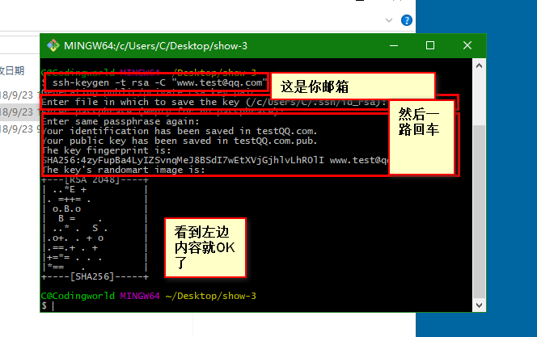
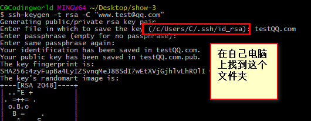
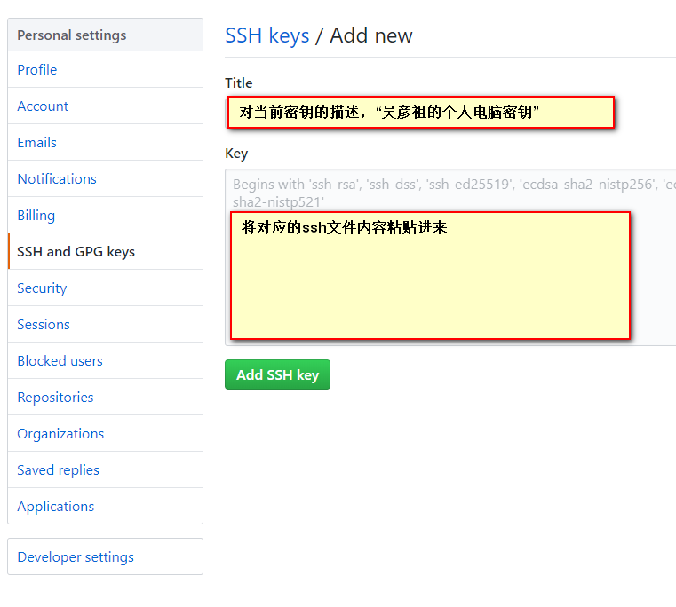
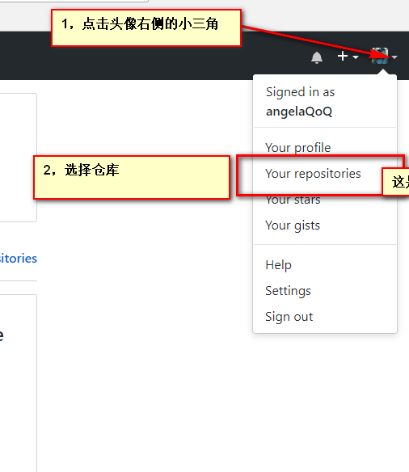
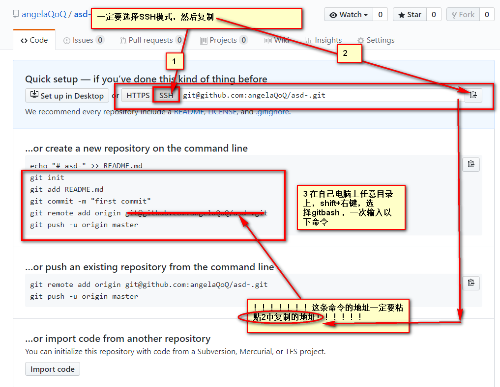

# 一 使用github
-------------------------------------------------------------------------------------------

## 1,什么是github？

+ Git 并不像 SVN 那样有个中心服务器。
+ 目前我们使用到的 Git 命令都是在本地执行，如果你想通过 Git 分享你的代码或者与其他开发人员合作。 你就需要将数据放到一台其他开发人员能够连接的服务器上.
  
-------------------------------------------------------------------------------------------

## 2,github账号注册
  **账号注册：https://github.com/**
  > 在gitbush窗口中配置用户名和密码
  + **git config --global user.name 你的用户名**
  + **git config --global user.email 你的github注册邮箱**

-------------------------------------------------------------------------------------------

## 搭建个人仓库的步骤(这是到公司的必做的步骤)

## 3，生成sshKey
+ 本地安装git.exe---一路下一步安装就ok
  
+ 在桌面shift+鼠标右键，选择git bush here
  
+ 由于你的本地Git仓库和GitHub仓库之间的传输是通过SSH加密的，所以我们需要配置验证信息：
-------------------------------------------------------------------------------------------

+ ***使用以下命令生成SSH Key：***
    > ssh-keygen 
    

+ 打开自己的电脑按照图片查找刚刚生成sshKey文件
    

-------------------------------------------------------------------------------------------

## 4，认证远程仓库和本地密钥（合法登陆）
+ 点击头像小三角，选择settings，点击
-------------------------------------------------------------------------------------------
+ 在左侧栏目中选择***SSH and GPGkeys***
    
+ 选择右上角***new SSH key***点击
    
-------------------------------------------------------------------------------------------

## 5，登陆github创建一个仓库  （sign in登陆   sign up注册）
+ **登陆github，创建一个自己的仓库**
  + 
  + 进入页面点击右上角***绿色New***按钮,按照以下步骤创建第一个仓库
  + 
  + ***查看代码仓库并关联*** 

-------------------------------------------------------------------------------------------

#   二  git常用命令
  ```
    git init                          初始化仓库   可以看到当前文件夹里出现一个.git文件夹
    git add *                         向本地 仓库暂存区 提交新增的内容
    git commint -m '描述文字'          向本地 仓库 提交内容，并标记描述
    git push 你的在线仓库地址  master    向远程仓库推送本地仓库中的最新代码


    其他命令
    git clone                         将远程仓库中的内容，克隆到本地仓库中，多用项目首次部署
    git fetch   +  git merge          从远程仓库拉取代码，并将最新内容合并到本地文件中
    git remote                        查看当前配置有哪些远程仓库，加上 -v 参数可以看到每个别名的实际链接地址
    git remote add origin 仓库地址    在本地添加远程仓库的地址
  ```

# 本地仓库使用
## 初始化仓库
``` git init ```生成一个.git隐藏文件夹

## 创建一些文件，添加内容

## 添加远程仓库的地址代号，变量，别名
``` git remote add 别名 ***你的***代码仓库地址

## 将文件夹中内容添加到暂存区
​``` git add * ```

## 将暂存区中内容添加到本地仓库
​```git commit -m '本次操作的描述'```

## 将本地仓库中的内容提交到远程仓库
​``` git push abc master ```

```